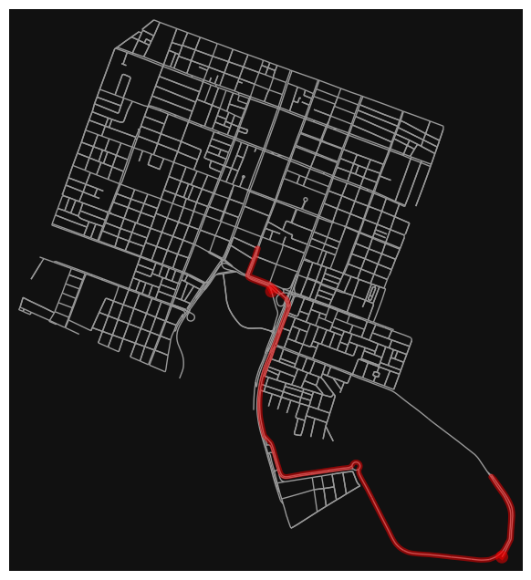

Discente: Júlia Alanne Silvino dos Santos

Matrícula: 20240001215

# Análise da Rede do Bairro Lagoa Nova - Natal/RN usando a biblioteca OSMnx 

Este projeto tem como objetivo explorar as funcionalidades da biblioteca OSMnx para realizar uma análise detalhada da rede viária do bairro Lagoa Nova, em Natal/RN. Utilizando diversas métricas de análise de rede, buscaremos responder a perguntas relevantes sobre a estrutura e o funcionamento da infraestrutura viária local.

No mapa gerado pelo OSMnx, os nós e arestas são elementos essenciais da estrutura da rede viária:

* Nós: Os nós representam pontos de interseção, cruzamentos ou locais onde as ruas começam ou terminam, como acessos e ramificações.

* Arestas: As arestas correspondem às ruas ou segmentos de rua que ligam dois nós, representando os trechos percorríveis da via entre interseções ou outros pontos importantes na rede.
* 

**Quantos componentes conectados existem na rede viária de Lagoa Nova e qual é o tamanho do maior componente conectado ?**
Componentes conectados = 33
Maior componente conectado = 1155

A rede viária de Lagoa Nova possui 33 componentes conectados, indicando que está fragmentada em várias sub-redes independentes, o que limita a conectividade e dificulta a mobilidade, especialmente em situações de congestionamento. 

O maior componente, com 1155 nós, representa a parte mais interconectada e acessível, abrangendo as principais vias e facilitando o deslocamento e o acesso a serviços. A presença de áreas isoladas sugere a necessidade de intervenções para melhorar a integração entre essas sub-redes, promovendo uma rede mais acessível e eficiente para os moradores. 
O grafico a seguir apresenta o maior componente conectado, ou seja, a maior sub-rede.

