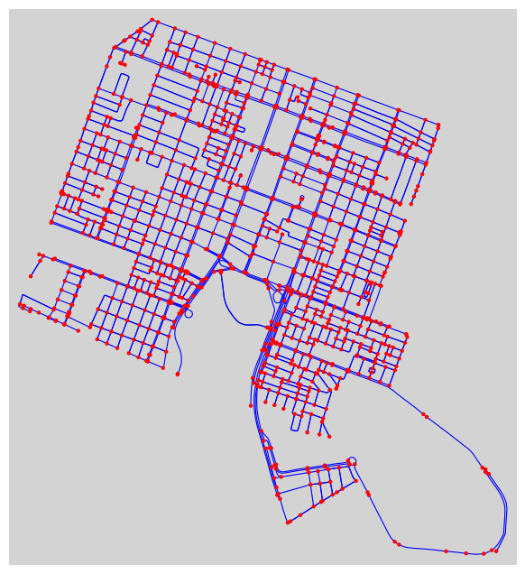
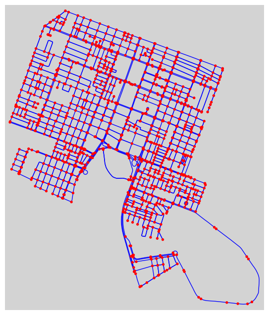
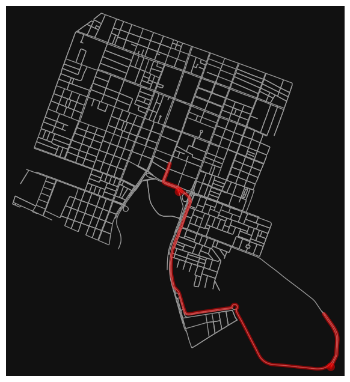

Discente: Júlia Alanne Silvino dos Santos

Matrícula: 20240001215

# Análise da Rede do Bairro Lagoa Nova - Natal/RN usando a biblioteca OSMnx 

Este projeto tem como objetivo explorar as funcionalidades da biblioteca OSMnx para realizar uma análise detalhada da rede viária do bairro Lagoa Nova, em Natal/RN. Utilizando diversas métricas de análise de rede, buscaremos responder a perguntas relevantes sobre a estrutura e o funcionamento da infraestrutura viária local.

