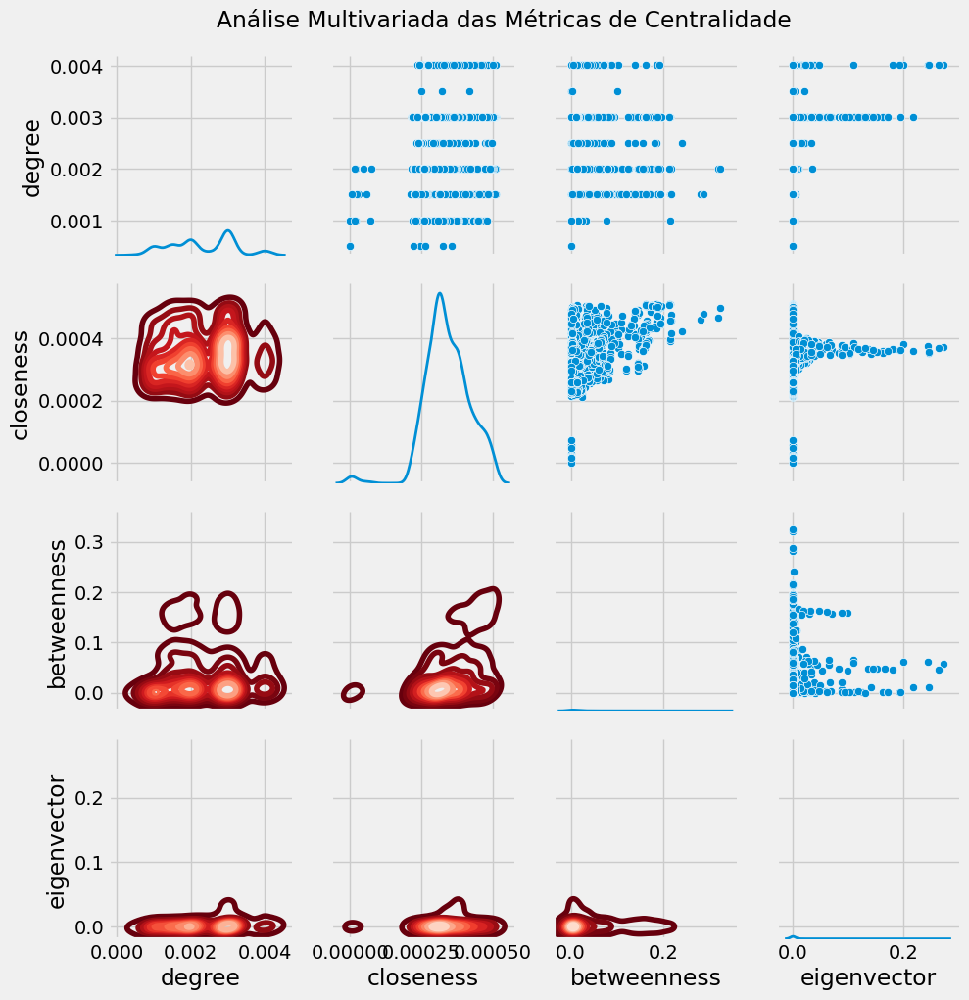
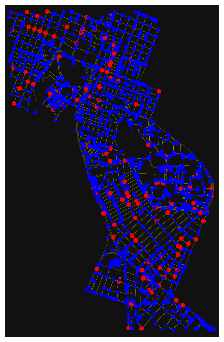

# Avaliação da mobilidade no entorno da UFRN, em Natal-RN.
## Descrição
Este trabalho tem como objetivo avaliar a mobilidade no entorno da UFRN, em Natal-RN, utilizando notebooks do [OSMnx](https://github.com/gboeing/osmnx) e a documentação da biblioteca. A análise busca identificar as melhores localizações para a implementação de dock-stations de compartilhamento de bicicletas nas proximidades da universidade, contribuindo para a melhoria da mobilidade e incentivando o uso de meios de transporte sustentável.

Além dos codigo é possivel observar uma breve explicação do projeto no [video]().

* Como forma analisar a rede foi decidido incluir os bairros Lagoa Nova, Candelália, e Capim Macio, no entorno da UFRN, com nós dentro de um raio de 3km de distância.

### Requisito 1 - Métricas de centralidade
#### Centralidade de graus

A centralidade de grau mede quantas conexões diretas um nó tem em uma rede. Ou seja, é o número de ligações que ele possui com outros nós. Esta ajuda a identificar os nós mais conectados em uma rede, mostrando quem ou o que está mais "conectado". Em uma rede viária, esses pontos podem ser interseções (cruzamento de ruas), e as arestas representam  as ruas que conectam duas interseções.

Na rede acima, os nós em azul indicam uma centralidade de grau menor (menos conexões ou menor importância na rede viária). Enquanto, os nós em amarelo possuem maior centralidade de grau, indicando pontos de maior conexão e, possivelmente, áreas mais movimentadas ou interseções centrais.

#### Centralidade de Proximidade

A centralidade de proximidade avalia a posição de um nó em relação a todos os outros nós de uma rede, determinando o quão "próximo" ele está dos demais. Em vez de focar nas conexões diretas (como a centralidade de grau), essa medida considera a distância total de um nó a todos os outros, indicando quão facilmente ele pode alcançar os demais.

Na rede acima os nós em tons mais claros (amarelos)apresentam uma centralidade de proximidade mais alta, o que significa que são interseções com acessibilidade vantajosa, possivelmente no centro do bairro ou em pontos de convergência de várias ruas. Esses nós estão em uma posição central dentro da rede e podem ser alcançados mais rapidamente a partir de qualquer outro nó. Diferente dos nós em tons mais escuros (azul e roxo), ou seja, estes nós têm centralidade de proximidade mais baixa, o que indica que estão em regiões menos conectadas. Eles provavelmente precisam de mais etapas (ou ruas) para acessar a maioria dos outros pontos da rede.

#### Centralidade de Intermediação

A centralidade de intermediação quantifica o papel de um nó como intermediário em uma rede. Esta avalia quantas vezes um nó aparece nos caminhos mais curtos entre outros pares de nós. Essa medida é útil para identificar nós que atuam como "pontes" ou "conectores" na rede, influenciando o fluxo de informações.

Na rede acima, os nós em tons mais claros (amarelos e verdes) têm uma alta centralidade de intermediação, significando que eles atuam como pontos de passagem chave na rede. Já os nós em tons mais escuros (roxo) têm baixa centralidade de intermediação, o que indica que são menos importantes para a conectividade geral da rede. Eles estão frequentemente localizados nas periferias ou em ruas que não servem como rotas principais de tráfego.

#### Centralidade de Autovetor

A centralidade de autovetor mede a importância de um nó em uma rede, levando em consideração não apenas o número de conexões diretas (como na centralidade de grau), mas também a importância dos nós aos quais ele está conectado. Isso significa que, para que um nó tenha uma alta centralidade de autovetor, ele precisa estar conectado a outros nós que também são importantes na rede.

Na rede os nós com tons mais claros (amarelo ou verde claro) representam locais com alta centralidade de autovetor. Esses pontos são fundamentais para a estrutura da rede, pois estão conectados a outros nós influentes e com grande fluxo. Diferente dos nós em tons mais escuros (roxo).

### Requisito 2 - PDF e CDF
#### Curva de Densidade de Probabilidade (PDF)

A PDF dos graus em uma rede é uma representação que permite visualizar como os graus dos nós estão distribuídos ao longo da rede. Ela fornece uma estimativa contínua da distribuição dos graus e indica a frequência relativa de cada grau, ou seja, com que frequência certos graus aparecem em comparação com outros.

O grau mais frequente na rede é em torno de 6, o que indica que a maioria dos nós tende a ter aproximadamente 6 conexões.

####  Função de Distribuição Acumulada (CDF)
A CDF dos graus em uma rede é uma ferramenta poderosa para analisar a conectividade da rede. Ela mostra a proporção acumulada de nós com grau igual ou inferior a um determinado valor, permitindo identificar rapidamente a distribuição da conectividade entre os nós.

A curva da CDF mantem estabiloidade em aproximadamente 1 (ou 100%) após o grau 8, o que sugere que poucos nós têm graus superiores a este valor.

A partir das métricas de centralidade e da análise multivariada, sugerir os bairros ou interseções de alta centralidade como locais ideais para a instalação de dock-stations de bicicletas.

### Requisito 3 - Analisando a Matriz de Correlação das Métricas de Centralidade
* Na diagonal principal, observa-se a distribuição de cada métrica de forma isolada. A aparência dessa distribuição (se é normal, bimodal, etc.) pode revelar características específicas da rede. Por exemplo, uma distribuição de grau com uma cauda longa indica que há poucos nós com um grande número de conexões.

* A sobreposição das distribuições pode sugerir que algumas métricas estão refletindo informações parecidas. Por exemplo, se as distribuições de grau (degree) e intermediação (betweenness) apresentam uma grande sobreposição, isso pode indicar que os nós com alto grau também tendem a ter alta intermediação, sugerindo que são tanto bem conectados quanto frequentemente atravessados em caminhos na rede.

Fora da diagonal principal, encontram-se as correlações entre pares de métricas. Valores próximos de 1 indicam uma forte correlação positiva, o que significa que, ao aumentar uma métrica, a outra também tende a crescer. Valores próximos de -1 revelam uma forte correlação negativa, indicando que, quando uma métrica aumenta, a outra tende a diminuir. Valores próximos de 0 sugerem que não há uma relação clara ou consistente entre as métricas.

### Requisito 4 - Quem é o core/shell da rede?

### 
De acordo com as análises, a distribuição da mobilidade e conectividade ao redor da UFRN, os bairros Candelária e Capim Macio apresentaram altos índices de centralidade. Com base nas métricas, foram identificados alguns locais em potenciais para a instalação de dock-stations de bicicletas compartilhadas, levando em consideração as áreas com alta conectividade e proximidade.
