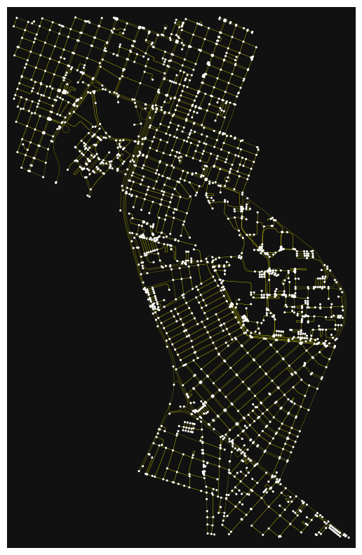
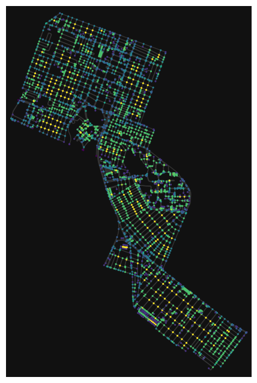
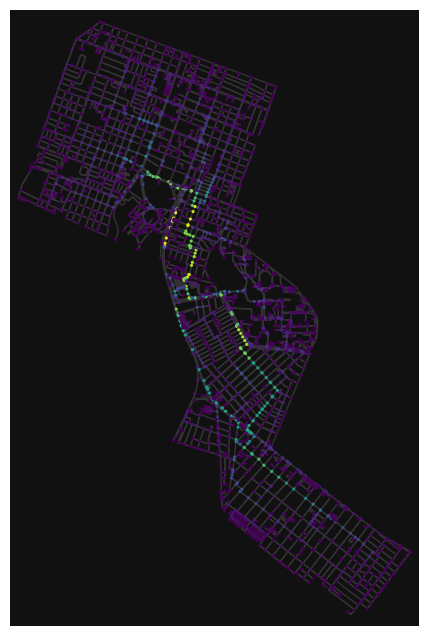
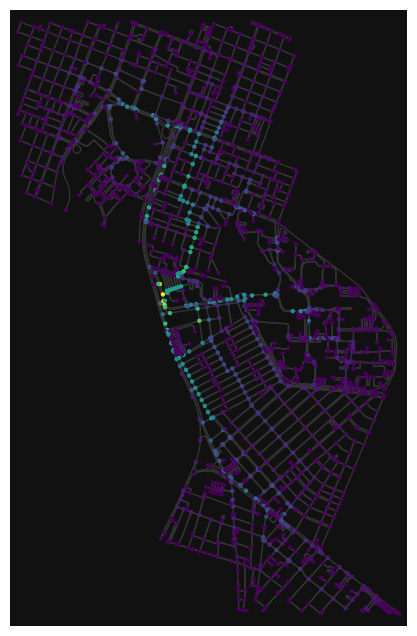
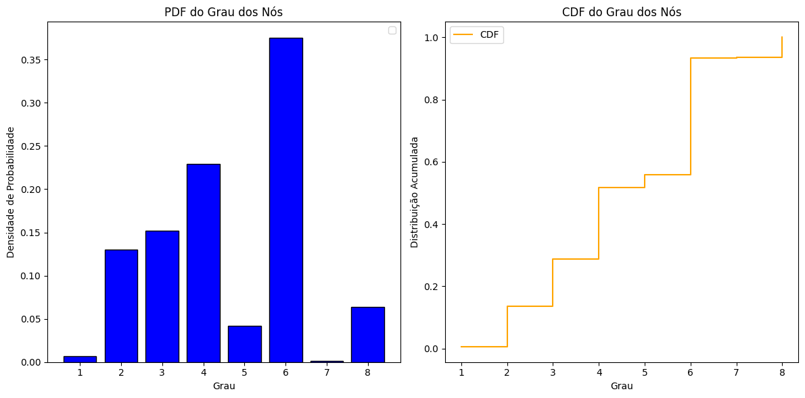
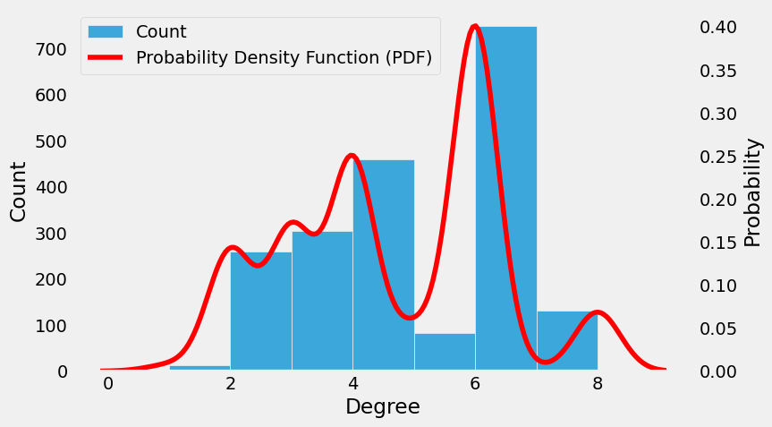
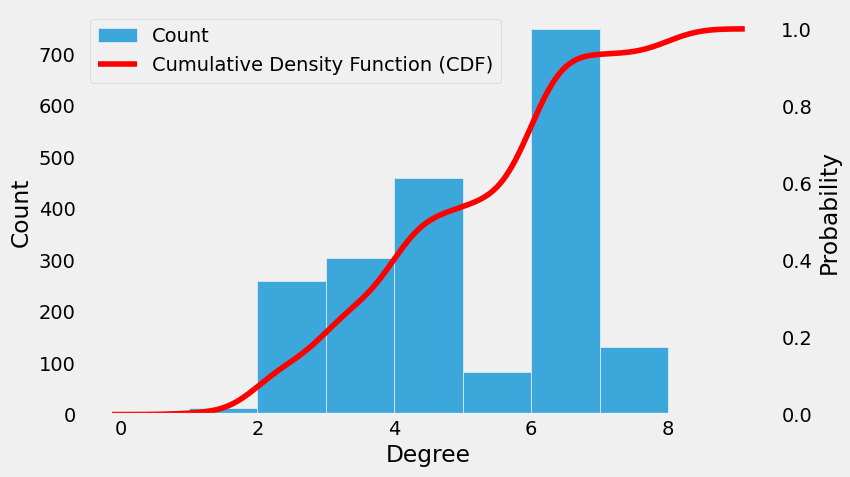

# Avaliação da mobilidade no entorno da UFRN, em Natal-RN.

### Requisito 1 - Métricas de centralidade
#### Centralidade de graus

#### Centralidade de Proximidade

#### Centralidade de Intermediação

#### Centralidade de Autovetor

### Requisito 2 - PDF e CDF

### Requisito 3 - Analisando a Matriz de Correlação das Métricas de Centralidade

### Requisito 4 - Quem é o core/shell da rede?
