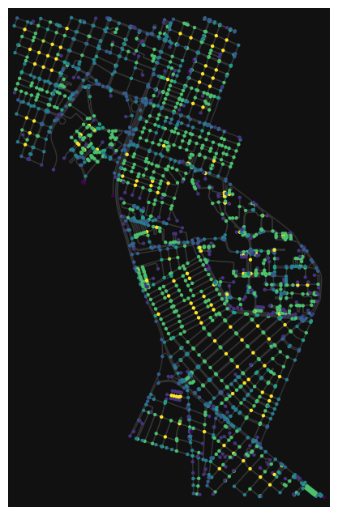

# Avaliação da mobilidade no entorno da UFRN, em Natal-RN.
## Descrição
Este trabalho tem como objetivo avaliar a mobilidade no entorno da UFRN, em Natal-RN, utilizando notebooks do [OSMnx](https://github.com/gboeing/osmnx) e a documentação da biblioteca. A análise busca identificar as melhores localizações para a implementação de dock-stations de compartilhamento de bicicletas nas proximidades da universidade, contribuindo para a melhoria da mobilidade e incentivando o uso de meios de transporte sustentável.

Além dos codigo é possivel observar uma breve explicação do projeto no [video]().

* Como forma analisar a rede foi decidido incluir os bairros Lagoa Nova, Candelália, e Capim Macio, no entorno da UFRN, com nós dentro de um raio de 3km de distância.

### Requisito 1 - Métricas de centralidade
#### Centralidade de graus

A centralidade de grau mede quantas conexões diretas um nó tem em uma rede. Ou seja, é o número de ligações que ele possui com outros nós. Esta ajuda a identificar os nós mais conectados em uma rede, mostrando quem ou o que está mais "conectado". Em uma rede viária, esses pontos podem ser interseções (cruzamento de ruas), e as arestas representam  as ruas que conectam duas interseções.

Na rede acima, os nós em azul indicam uma centralidade de grau menor (menos conexões ou menor importância na rede viária). Enquanto, os nós em amarelo possuem maior centralidade de grau, indicando pontos de maior conexão e, possivelmente, áreas mais movimentadas ou interseções centrais.

#### Centralidade de Proximidade

A centralidade de proximidade avalia a posição de um nó em relação a todos os outros nós de uma rede, determinando o quão "próximo" ele está dos demais. Em vez de focar nas conexões diretas (como a centralidade de grau), essa medida considera a distância total de um nó a todos os outros, indicando quão facilmente ele pode alcançar os demais.

Na rede acima os nós em tons mais claros (amarelos)apresentam uma centralidade de proximidade mais alta, o que significa que são interseções com acessibilidade vantajosa, possivelmente no centro do bairro ou em pontos de convergência de várias ruas. Esses nós estão em uma posição central dentro da rede e podem ser alcançados mais rapidamente a partir de qualquer outro nó. Diferente dos nós em tons mais escuros (azul e roxo), ou seja, estes nós têm centralidade de proximidade mais baixa, o que indica que estão em regiões menos conectadas. Eles provavelmente precisam de mais etapas (ou ruas) para acessar a maioria dos outros pontos da rede.

#### Centralidade de Intermediação

A centralidade de intermediação quantifica o papel de um nó como intermediário em uma rede. Esta avalia quantas vezes um nó aparece nos caminhos mais curtos entre outros pares de nós. Essa medida é útil para identificar nós que atuam como "pontes" ou "conectores" na rede, influenciando o fluxo de informações.

#### * Centralidade de Autovetor

A centralidade de autovetor mede a importância de um nó em uma rede, levando em consideração não apenas o número de conexões diretas (como na centralidade de grau), mas também a importância dos nós aos quais ele está conectado. Isso significa que, para que um nó tenha uma alta centralidade de autovetor, ele precisa estar conectado a outros nós que também são importantes na rede.

### Requisito 2 - PDF e CDF
Análise da CDF e PDF dos graus dos nós para compreender o comportamento da rede (se ela segue uma distribuição de tipo "lei de potência", que é comum em redes complexas). 

Análise multivariada das métricas de centralidade:
Aplicação de técnicas de análise multivariada para observar como diferentes métricas de centralidade estão relacionadas e como elas podem ser usadas para identificar zonas de alta mobilidade.

A partir das métricas de centralidade e da análise multivariada, sugerir os bairros ou interseções de alta centralidade como locais ideais para a instalação de dock-stations de bicicletas.

### Requisito 3 - Analisando a Matriz de Correlação das Métricas de Centralidade

### Requisito 4 - Quem é o core/shell da rede?

