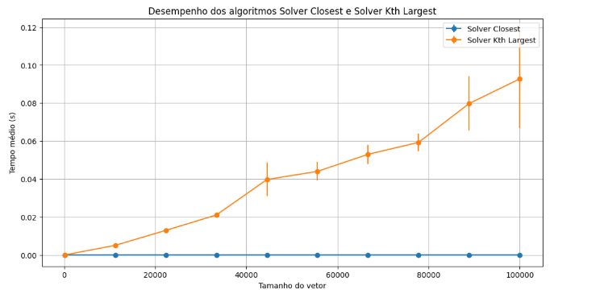
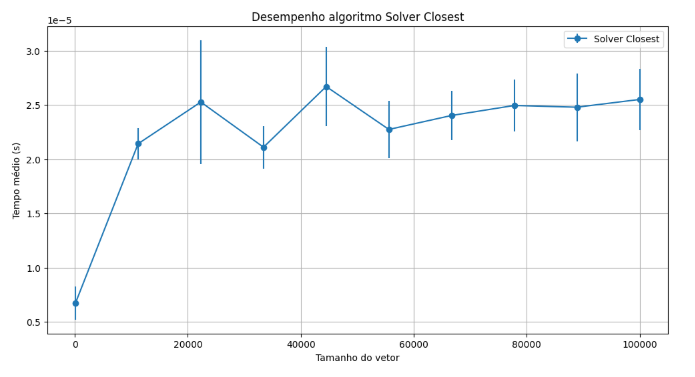

Discente: Júlia Alanne Silvino dos Santos

Matrícula: 20240001215

## Desempenho de algoritmos
### Objetivo:
Avaliar o desempenho de dois algoritmos fornecidos(solver_closest.ipynb e solver_kth_largest.ipynb) considerando diversas entradas aleatórias e reproduzíveis, variando o tamanho do vetor de entrada até um valor N grande.

O [vídeo](https://youtu.be/7YmguAky7DI) apresenta uma breve explicação da atividade desenvolvida.

### Requisitos
* Instrumentar os códigos fornecidos com o módulo time para medir o tempo de execução.
*  Realizar testes com vetores de tamanhos variados.
*   Para cada tamanho de vetor, realizar múltiplas execuções e calcular o tempo médio e o
intervalo de confiança.
* Gerar gráficos com tamanho do vetor (eixo x), tempo médio de execução (eixo y), e intervalos de confiança como barras de erro no gráfico.

### Metodologia

Para esta atividade, uma metodologia consiste em executar os algoritmos repetidamente em diferentes tamanhos de árvores de busca binária (BST), a fim de medir o tempo de execução com o  módulo time. Os testes foram realizados com dados gerados aleatoriamente de forma reprodutível para 10 árvores, com tamanhos progressivamente maiores, variando de 100 a 100.000 elementos. Um nível de confiança de 95% foi adotado para calcular o intervalo de confiança, levando em consideração as variações no tempo de execução observadas nas 15 execuções de cada algoritmo.

### Resultados 
Os resultados mostram que o algoritmo _solver_kth_largest_ apresenta uma complexidade de tempo linear, como demonstrado pelo aumento contínuo no tempo de execução conforme o tamanho da árvore binária de busca (BST). Enquanto o algoritmo _solver_closest_ apresenta uma complexidade de tempo logarítmica, com o tempo de execução crescendo a uma taxa significativamente mais lenta em relação ao tamanho da árvore. Ad pequenas barras de erro em nossos gráficos indicam alta precisão de precisão, resultado do grande número de observações (15) realizadas para cada configuração de teste.

