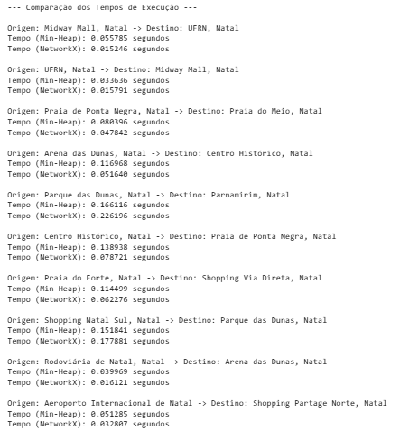

Discente: Júlia Alanne Silvino dos Santos

Matrícula: 20240001215

## Algoritmos Clássicos (Dijkstra e Kruskal)
PARTE 1: Comparando Algoritmos de Dijkstra: Min-Heap e NetworkX

Avaliar o algoritmo de dijkstra compartilhado no arquivo [dijsktra_min_heap](dijsktra_min_heap.ipynb) com a
solução presente no networkx e visualizar o resultado no OSMnx.

### Objetivo

O objetivo principal é comparar o desempenho dos dois algoritmos em termos de tempo de execução para diferentes pares de pontos de interesse (POIs) na cidade de Natal-RN, usando:

* Algoritmo de Dijkstra com Min-Heap (implementado manualmente).

* Algoritmo de Dijkstra com NetworkX (função shortest_path).

### Desenvolvimento
Foram definidos os seguintes POIs
**POIs**

### Origens:
* 1- Shopping Midway Mall
* 2- Universidade Federal do Rio Grande do Norte (UFRN)
* 3- Praia de Ponta Negra
* 4- Arena das Dunas
* 5- Parque das Dunas
* 6- Centro Histórico de Natal
* 7- Praia do Forte
* 8- Shopping Natal Sul
* 9- Rodoviária de Natal
* 10-Aeroporto Internacional de Natal (São Gonçalo do Amarante)

###  Destinos:
* 1- UFRN
* 2- Morro do careca
* 3- Praia do Meio
* 4- Centro Histórico de Natal
* 5- Parnamirim (Av. Ayrton Senna)
* 6- Praia de Ponta Negra
* 7- Shopping Via Direta
* 8- Parque das Dunas
* 9- Arena das Dunas
* 10- Shopping Partage Norte
  
  ### Resultados

  Para cada par de origem e destino, foram comparados:

Tempo de Execução:

* O tempo de execução foi medido para os dois algoritmos (Min-Heap e NetworkX), conforme apresentado na figira a baixo.

  Visualização de Caminhos:

* Os caminhos gerados pelos algoritmos foram sobrepostos em mapas.

* Azul representa o caminho calculado pelo NetworkX.

* Verde representa o caminho calculado pelo Min-Heap.

Análise:

* Ambos os algoritmos produziram os mesmos caminhos mínimos em termos de rota, conforme podemos observar na figura abaixo

* O algoritmo com NetworkX teve desempenho melhor em tempo de execução.

