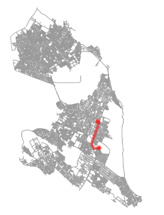
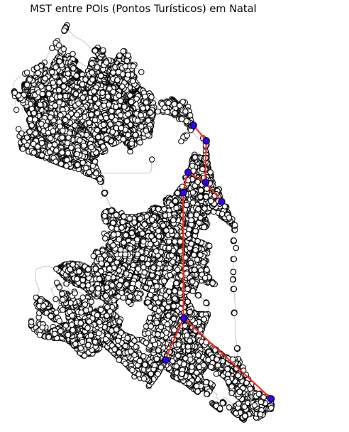

Discente: Júlia Alanne Silvino dos Santos

Matrícula: 20240001215

## Algoritmos Clássicos (Dijkstra e Kruskal)

#### Algoritmo de Dijkstra:

O algoritmo de Dijkstra é um método para encontrar o caminho mais curto em grafos ponderados com arestas de pesos positivos. Ele começa de um nó de origem, calcula as menores distâncias para os outros nós e constrói o caminho mais eficiente até o destino.

#### Algoritmo de Kruskal

O algoritmo de Kruskal é um método eficiente e amplamente utilizado para determinar a Árvore Geradora Mínima (Minimum Spanning Tree - MST) em um grafo ponderado e conectado, garantindo a menor soma possível dos pesos das arestas que conectam todos os vértices.

## PARTE 1: Comparando Algoritmos de Dijkstra: Min-Heap e NetworkX 

### Objetivo
O objetivo principal é  avaliar o  desempenho  do algoritmo de dijkstra compartilhado no arquivo [dijsktra_min_heap](dijsktra_min_heap.ipynb) com a solução presente no networkx (função shortest_path)  para diferentes pares de pontos de interesse (POIs) na cidade de Natal-RN e visualizar o resultado no OSMnx.

### Desenvolvimento
Foram definidos os seguintes POIs (Origens, Destino):

  * Shopping Midway Mall, UFRN
  * Universidade Federal do Rio Grande do Norte (UFRN), Morro do careca
  * Praia de Ponta Negra, Praia do Meio
  * Arena das Dunas, Centro Histórico de Natal
  * Parque das Dunas,  Parnamirim (Av. Ayrton Senna)
  * Centro Histórico de Natal, Praia de Ponta Negra
  * Praia do Forte, Shopping Via Direta
  * Shopping Natal Sul,Parque das Dunas
  * Rodoviária de Natal, Arena das Dunas
  * Aeroporto Internacional de Natal (São Gonçalo do Amarante), Shopping Partage Norte
  
### Resultados

Para cada par de origem e destino, foram comparados:

Tempo de Execução:

* O tempo de execução foi medido para os dois algoritmos (Min-Heap e NetworkX), conforme apresentado na figura a baixo.

Visualização de Caminhos:

* Os caminhos gerados pelos algoritmos foram sobrepostos em mapas.

  
  

### Análise:

* Ambos os algoritmos produziram os mesmos caminhos mínimos em termos de rota.

* O algoritmo com NetworkX teve desempenho melhor em tempo de execução.

* 

## PARTE 2 - Uso do Algoritmo de Kruskal otimização de roteiro Turístico

Este projeto utiliza o **algoritmo de Kruskal** para calcular a  MST que conecta os principais pontos turísticos da cidade de Natal-RN, criando um roteiro eficiente que minimiza as distâncias percorridas.

### Objetivo
O objetivo demonstrar a aplicação do algoritmo de Kruskal  para otimizar um roteiro turístico em Natal-RN , conectando atrações de forma eficiente e econômica.

### Desenvolvimento
1. **Modelagem do Grafo**:
   - Cada ponto turístico foi representado como um vértice.
   - As distâncias entre os pontos foram utilizadas como pesos das arestas.

2. **Execução do Algoritmo de Kruskal**:
   - Ordenação das arestas por peso em ordem crescente.
   - Adição das arestas ao conjunto da MST, desde que não formem ciclos.
   - O processo foi repetido até conectar todos os pontos turísticos, resultando na MST.

3. **Ferramentas Utilizadas**:
   - `OSMnx`: Para trabalhar com mapas e dados geográficos.
   - `networkx`: Para modelagem e manipulação do grafo.
   - `matplotlib`: Para visualização gráfica dos resultados.
  

### Resultados
- O algoritmo gerou uma rota otimizada conectando todos os pontos turísticos com a menor soma de distâncias.
- Comprimento total da MST: **28.823,45 metros**.
- A MST gerada foi sobreposta ao mapa de Natal. De modo que as rotas otimizadas foram destacadas em vermelho, enquanto os POIs foram marcados como pontos azuis para facilitar a interpretação.
- A visualização do grafo com a MST está representada abaixo:

  

- O comprimento total da MST, equivalente a 28.823,45 metros, representa a menor distância necessária para conectar todos os pontos turísticos selecionados. Esse valor reflete um roteiro otimizado que reduz deslocamentos, tornando-o ideal para turistas que desejam explorar diversos locais de forma prática e eficiente. Além disso, a rota oferece uma solução estratégica para planejamento de transporte turístico, reduzindo custos operacionais e tempo de viagem, além de possibilitar a criação de itinerários guiados personalizados.

