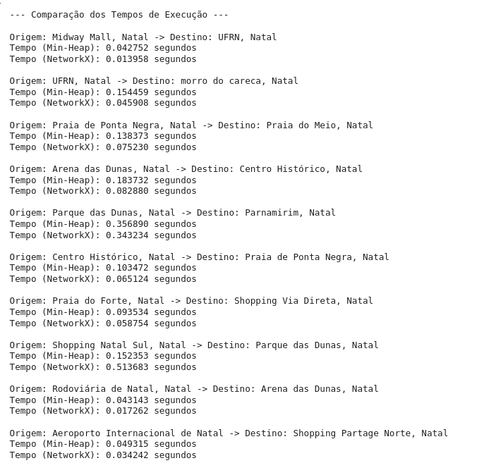
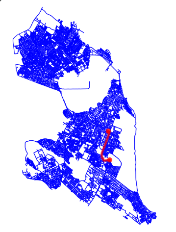

Discente: Júlia Alanne Silvino dos Santos

Matrícula: 20240001215


## Algoritmos Clássicos (Dijkstra e Kruskal)

#### Algoritmo de Dijkstra:

O algoritmo de Dijkstra é um método para encontrar o caminho mais curto em grafos ponderados com arestas de pesos positivos. Ele começa de um nó de origem, calcula as menores distâncias para os outros nós e constrói o caminho mais eficiente até o destino.

#### Algoritmo de Kruskal

O algoritmo de Kruskal é um método eficiente e amplamente utilizado para determinar a Árvore Geradora Mínima (Minimum Spanning Tree - MST) em um grafo ponderado e conectado, garantindo a menor soma possível dos pesos das arestas que conectam todos os vértices.


## PARTE 1: Comparando Algoritmos de Dijkstra: Min-Heap e NetworkX 

### Objetivo
- O objetivo principal é avaliar o desempenho do algoritmo de Dijkstra compartilhado no arquivo [dijsktra_min_heap](dijsktra_min_heap.ipynb) com a solução presente no NetworkX (função `shortest_path`) para diferentes pares de pontos de interesse (POIs) na cidade de Natal-RN, utilizando visualizações geradas pela biblioteca OSMnx.

### POIs Definidos
- Os seguintes pares de origem e destino foram escolhidos:

1. **Shopping Midway Mall** → **UFRN**
2. **Universidade Federal do Rio Grande do Norte (UFRN)** → **Morro do Careca**
3. **Praia de Ponta Negra** → **Praia do Meio**
4. **Arena das Dunas** → **Centro Histórico de Natal**
5. **Parque das Dunas** → **Parnamirim (Av. Ayrton Senna)**
6. **Centro Histórico de Natal** → **Praia de Ponta Negra**
7. **Praia do Forte** → **Shopping Via Direta**
8. **Shopping Natal Sul** → **Parque das Dunas**
9. **Rodoviária de Natal** → **Arena das Dunas**
10. **Aeroporto Internacional de Natal (São Gonçalo do Amarante)** → **Shopping Partage Norte**

---

### Desenvolvimento

#### Função Min-Heap

- Segue abaixo o código utilizado para implementar o algoritmo de Dijkstra com Min-Heap:

```python
# Função para implementação de Dijkstra com Min-Heap
def dijkstra_min_heap(graph, origem, destino):
    dist = {node: float('inf') for node in graph.nodes}
    dist[origem] = 0
    prev = {node: None for node in graph.nodes}
    min_heap = [(0, origem)]  # (distância acumulada, nó)

    while min_heap:
        current_dist, current_node = heapq.heappop(min_heap)

        if current_node == destino:
            break

        if current_dist > dist[current_node]:
            continue

        for neighbor, edge_data in graph[current_node].items():
            weight = edge_data[0].get("length", 1)
            distance = current_dist + weight

            if distance < dist[neighbor]:
                dist[neighbor] = distance
                prev[neighbor] = current_node
                heapq.heappush(min_heap, (distance, neighbor))

    # Reconstruir o caminho
    path = []
    node = destino
    while node is not None:
        path.insert(0, node)
        node = prev[node]

    return path
```

---

- Segue abaixo o código utilizado para comparar os tempos de execução
``` python

# Lista para armazenar os tempos
resultados = []

# Iterar pelos pares de origem e destino
for i in range(len(origens)):
    # Obter coordenadas
    origem_coord = ox.geocode(origens[i])
    destino_coord = ox.geocode(destinos[i])

    # Encontrar os nós mais próximos no grafo
    origem = ox.distance.nearest_nodes(G, origem_coord[1], origem_coord[0])
    destino = ox.distance.nearest_nodes(G, destino_coord[1], destino_coord[0])

    # Dijkstra com Min-Heap
    start_time = time.time()
    path_min_heap = dijkstra_min_heap(G, origem, destino)
    time_min_heap = time.time() - start_time

    # Dijkstra com NetworkX
    start_time = time.time()
    path_nx = nx.shortest_path(G, origem, destino, weight="length")
    time_nx = time.time() - start_time

    # Salvar resultados, incluindo o caminho
    resultados.append({
        "origem": origens[i],
        "destino": destinos[i],
        "tempo_min_heap": time_min_heap,
        "tempo_networkx": time_nx,
        "path_min_heap": path_min_heap,  # Adiciona o caminho lculado por min_heap
        "path_nx": path_nx # Adiciona o caminho calculado por NetworkX

    })

# Exibir os resultados e plotar os grafos
print("\n--- Comparação dos Tempos de Execução ---\n")
for resultado in resultados:
    print(f"Origem: {resultado['origem']} -> Destino: {resultado['destino']}")
    print(f"Tempo (Min-Heap): {resultado['tempo_min_heap']:.6f} segundos")
    print(f"Tempo (NetworkX): {resultado['tempo_networkx']:.6f} segundos\n")


```

### Resultados

#### Tempo de Execução

- Os tempos de execução para cada par de origem e destino foram medidos e comparados entre os dois algoritmos. O gráfico abaixo ilustra o desempenho:



#### Visualização de Caminhos

- Os caminhos gerados por ambos os algoritmos foram sobrepostos em mapas utilizando OSMnx. Conforme apresentado na imagem abaixo.




---

### Análise

- Ambos os algoritmos produziram os mesmos caminhos mínimos em termos de rota, indicando que ambos são corretos.
- O algoritmo implementado com NetworkX apresentou melhor desempenho em termos de tempo de execução.

---


## PARTE 2 - Uso do Algoritmo de Kruskal otimização de roteiro Turístico

Este projeto utiliza o **algoritmo de Kruskal** para calcular a  MST que conecta os principais pontos turísticos da cidade de Natal-RN, criando um roteiro eficiente que minimiza as distâncias percorridas.

### Objetivo
O objetivo demonstrar a aplicação do algoritmo de Kruskal  para otimizar um roteiro turístico em Natal-RN , conectando atrações de forma eficiente e econômica.


### Desenvolvimento
1. **Modelagem do Grafo**:
   - Cada ponto turístico foi representado como um vértice.
   - As distâncias entre os pontos foram utilizadas como pesos das arestas.

2. **Execução do Algoritmo de Kruskal**:
   - Ordenação das arestas por peso em ordem crescente.
   - Adição das arestas ao conjunto da MST, desde que não formem ciclos.
   - O processo foi repetido até conectar todos os pontos turísticos, resultando na MST.

3. **Ferramentas Utilizadas**:
   - `OSMnx`: Para trabalhar com mapas e dados geográficos.
   - `networkx`: Para modelagem e manipulação do grafo.
   - `matplotlib`: Para visualização gráfica dos resultados.
  

### Resultados
- O algoritmo gerou uma rota otimizada conectando todos os pontos turísticos com a menor soma de distâncias.
- Comprimento total da MST: **28.823,45 metros**.
-A MST gerada foi sobreposta ao mapa de Natal, com as rotas otimizadas destacadas em vermelho, enquanto os POIs foram marcados como pontos azuis para facilitar a interpretação.
- A visualização do grafo com a MST está representada abaixo:

  

- A MST gerada pelo algoritmo de Kruskal oferece um roteiro otimizado que pode ser utilizado como base para sistemas de transporte turístico ou até mesmo para guias turísticos personalizados.

### Análise

- O comprimento total da MST, equivalente a 28.823,45 metros, representa a menor distância necessária para conectar todos os pontos turísticos selecionados. Esse valor reflete um roteiro otimizado que reduz deslocamentos, tornando-o ideal para turistas que desejam explorar diversos locais de forma prática e eficiente. Além disso, a rota oferece uma solução estratégica para planejamento de transporte turístico, reduzindo custos operacionais e tempo de viagem, além de possibilitar a criação de itinerários guiados personalizados.


Segue os links para os videos  [PARTE 1](https://youtu.be/r4T2wbtgtPQ) e [PARTE 2](https://youtu.be/TRr-iF_0svY)

