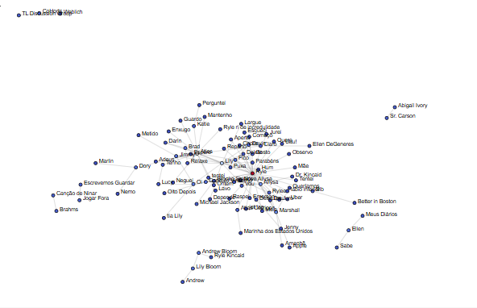
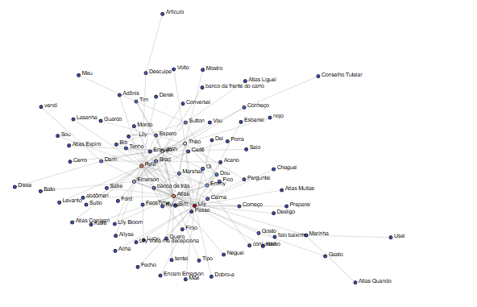
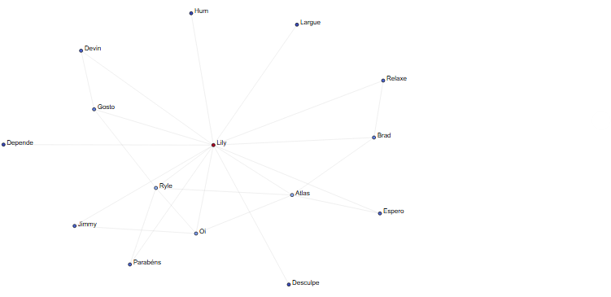
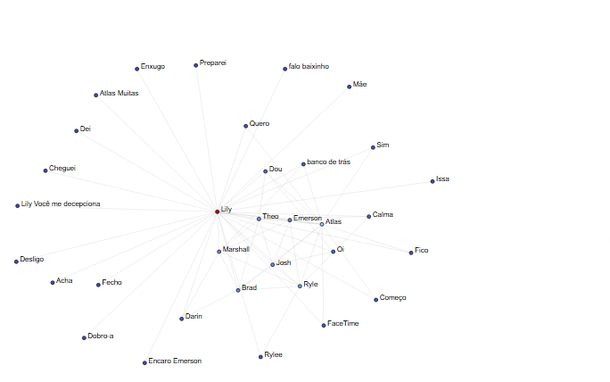

Discente: Júlia Alanne Silvino dos Santos

Matrícula: 20240001215

# Análise de Redes com Processamento de Linguagem Natural

Este repositório documenta um projeto de análise de redes, utilizando ferramentas de Processamento de Linguagem Natural (NLP), aplicado aos livros **É Assim Que Acaba** e **É Assim Que Começa**, da autora Colleen Hoover. O objetivo principal é explorar o padrão gramatical e semântico do estilo de escrita da autora, além de compreender a evolução das relações entre os personagens ao longo da duologia.

## Objetivo

O objetivo deste projeto é analisar as interações linguísticas e as relações entre personagens, temas e outros elementos narrativos nos livros **É Assim Que Acaba** e **É Assim Que Começa**. Através do uso de técnicas avançadas de NLP, buscamos explorar a consistência na construção das personagens e examinar como suas interações evoluem ao longo da narrativa.

## Tecnologias Utilizadas

- **Python**: Linguagem principal para processamento de texto e análise de dados.
- **Bibliotecas de NLP**:
  - **spaCy**: Utilizada para análise linguística, incluindo Part-of-Speech Tagging (PoS) e Named Entity Recognition (NER).
- **Bibliotecas de Visualização de Grafos**:
  - **NetworkX**: Para construção e análise de redes.
  - **Gephi**: Para visualização e análise avançada dos grafos gerados.

## Metodologia

### 1. Seleção e Preparação dos Textos

Foram utilizados os livros **[É Assim Que Acaba](e-assim-que-acaba.txt)** e **[É Assim Que Começa](e-assim-que-comeca.txt)**. Para garantir a qualidade da análise, foi necessário realizar a limpeza e normalização dos textos, removendo ruídos como cabeçalhos e rodapés. A função a seguir foi utilizada para esse propósito:

```python
def get_data():
    file_path = "/content/e-assim-que-comeca.txt"

    # Ler o conteúdo do arquivo local
    with open(file_path, "r", encoding="utf-8") as file:
        text = file.read()

    # Remover junk do cabeçalho
    cutoff = text.index('1. Atlas')
    text = text[cutoff:]

    # Remover junk do rodapé
    cutoff = text.rindex("quer ser minha peixinha?")
    text = text[:cutoff]

    # Pré-processamento para limpeza do texto
    text = text.replace('\r', ' ').replace('\n', ' ')

    return text
```

### 2. Análise de PoS Tagging e Named Entity Recognition (NER)

- **Part-of-Speech (PoS) Tagging**: Identificação das funções gramaticais das palavras (substantivos, verbos, adjetivos, advérbios, etc.).
- **Named Entity Recognition (NER)**: Identificação e classificação das entidades mencionadas no texto, como personagens, locais e eventos.

A implementação detalhada dessas técnicas pode ser visualizada no arquivo [U3T1.pynb].

### 3. Geração de Redes

Com base nas entidades extraídas, utilizamos o **NetworkX** para construir grafos, onde as entidades são representadas como nós e as relações entre elas formam as arestas. Isso permite uma análise visual e quantitativa das interações entre personagens e elementos narrativos. Abaixo estão as visualizações dos grafos dos livros "É Assim Que Acaba" e "É Assim Que Começa":

- **Grafo de "É Assim Que Acaba"**
  

- **Grafo de "É Assim Que Começa"**
  

### 4. Análise da Rede

Foram calculadas métricas como o grau dos nós, centralidade e hubs. Essas métricas permitem analisar a importância de cada personagem dentro da rede e compreender melhor as interações que estruturam a narrativa. Além disso, extraímos a rede de ego dos personagens principais e o k-core da rede. A seguir, apresentamos as visualizações das redes de ego para os dois livros:

- **Rede de ego do Livro 1 ("É Assim Que Acaba")**
  

- **Rede de ego do Livro 2 ("É Assim Que Começa")**
  

### 5. Visualização e Produção do Grafo

A visualização dos grafos foi realizada com o uso do **Gephi**, gerando representações interativas que facilitam a exploração das conexões linguísticas e das relações entre os personagens. Esses gráficos podem ser explorados de forma dinâmica, permitindo uma análise mais detalhada da evolução das interações ao longo da duologia.

## Links para Visualização Interativa dos Grafos

- [Grafo interativo do Livro 1 (É Assim Que Acaba)](https://juliaalanne.github.io/Algoritmos-e-Estruturas-de-Dados-II/U3T1/network_/#)
- [Grafo interativo do Livro 2 (É Assim Que Começa)](https://juliaalanne.github.io/Algoritmos-e-Estruturas-de-Dados-II/U3T1/network/#)

## Resultados e Insights Obtidos

- **Personagens Centrais**: A análise das redes revelou que a personagem principal mantém uma construção consistente ao longo da duologia, com suas interações e traços de personalidade permanecendo coerentes entre os dois livros.

- **Mudança nas Relações de Personagens**: Em **É Assim Que Começa**, alguns personagens secundários ganham mais destaque, indicando uma evolução nas dinâmicas narrativas. Essa mudança reflete uma adaptação das relações, representando a transição entre os livros da duologia.

- **Estilo de Escrita da Autora**: A autora consegue manter a continuidade no estilo de escrita entre os dois volumes, ao mesmo tempo em que introduz flexibilidade para o desenvolvimento de novas interações e personagens. Isso demonstra como a complexidade do enredo é aprofundada, criando contrastes significativos entre os dois livros.

## Conclusão

Este estudo demonstrou como ferramentas de NLP podem ser utilizadas para analisar a evolução das relações entre personagens em uma narrativa literária. Além disso, destacou como padrões linguísticos e semânticos contribuem para a construção das personagens e a progressão do enredo ao longo da duologia.
